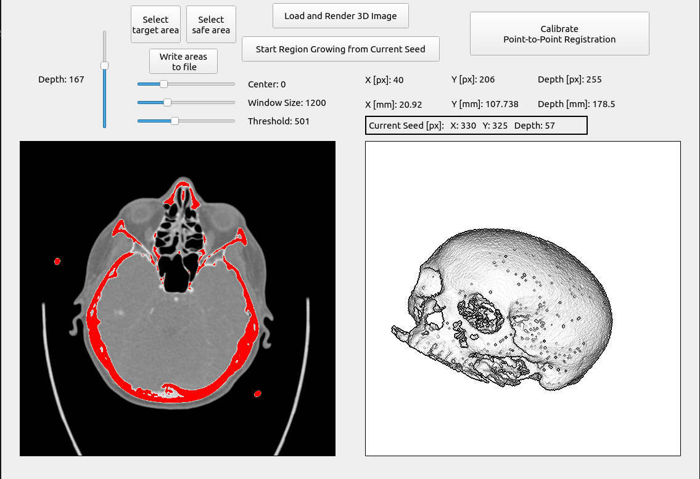

## Qt-based GUI Application for 3D Rendering of CT Scan Data

* Uses a ray casting approach to render a fully interactive 3D view of layer-based 2D CT scan images
* Implements a seed-based region growing segmentation algorithm in order to filter irrelevant image data
* Provides an additional slice view of the raw CT images at varying depths
* Smart error handling by implementing optional return values in C++14 via Status and StatusOr. These are simpler versions of Google's Status implementations from their Abseil library.

